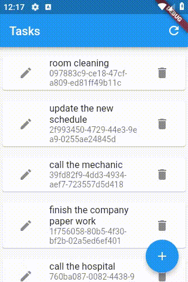

# e008_flutter_write_reorderable_listview_state_to_file_e004base

## Based On e007

- [elrashid-flutter-examples/e007_flutter_reorderable_listview_e004base](https://github.com/elrashid-flutter-examples/e007_flutter_reorderable_listview_e004base)

  - Based On e004 :

    - [elrashid-flutter-examples/e004_flutter_listview_crud_app_using_nonsecure_rest_api](https://github.com/elrashid-flutter-examples/e004_flutter_listview_crud_app_using_nonsecure_rest_api)

## Screen Record

## What

- Saving the Reorder state of the ReorderableListView to file system so it can be restored on refresh and restart of the app.

- non-dependent on the REST API

- the state is saved locally only

- must run with :

  - [elrashid-flutter-examples/e002-aspcore-rest-api-server-for-flutter](https://github.com/elrashid-flutter-examples/e002-aspcore-rest-api-server-for-flutter)

## Step 1

    Future sortTasksSaveState() async {
        await sortTasksSaveTofile(tasks.map((m) => m.guid).toList());
    }

    Future sortTasksSaveTofile(List<String> list) async {
        try {
        var listMap = List<Map<String, dynamic>>();
        for (var i = 0; i < list.length; i++) {
            var map = Map<String, dynamic>();
            map['order'] = i;
            map['guid'] = list[i];
            listMap.add(map);
        }

        Directory appDocDir = await getApplicationDocumentsDirectory();
        String appDocPath = appDocDir.path;
        var file = File(('$appDocPath/sortTasks.json'));
        var fileText = json.encode(listMap);
        file.writeAsStringSync(fileText);
        } catch (e) {
        print(e);
        }
    }

## Step 2

    Future<List<String>> sortTasksGetState() async {
        var list = List<String>();
        try {
        Directory appDocDir = await getApplicationDocumentsDirectory();
        String appDocPath = appDocDir.path;
        var file = File(('$appDocPath/sortTasks.json'));
        var fileText = file.readAsStringSync();
        final jsonOpj = json.decode(fileText);
        jsonOpj
            .forEach((element) => list.insert(element['order'], element['guid']));
        } catch (e) {
        print(e);
        }
        return list;
    }

## Step 3

    Future sortTasks() async {
        if (tasks != null) {
        tasksOrder = await sortTasksGetState();
        var newList = List<TaskOpj>();
        for (var i = 0; i < tasksOrder.length; i++) {
            var task = tasks.firstWhere((t) => t.guid == tasksOrder[i],
                orElse: () => null);
            tasks.remove(task);
            if (task != null) {
            newList.add(task);
            }
        }
        newList.addAll(tasks);
        tasks = newList;
        }
    }

## Step 4

    void _reorder(oldIndex, newIndex) {
        try {
        setState(() {
            if (newIndex > oldIndex) {
            newIndex -= 1;
            }
            final TaskOpj item = tasks.removeAt(oldIndex);
            tasks.insert(newIndex, item);
        });
        sortTasksSaveState();
        } catch (e) {
        print(e);
        }
    }

## Step 5

    Future refresh() async {
        tasks = await Tasks.allTasks();
        await sortTasks();
        setState(() {});
    }

## Step 6

    void initState() {
        super.initState();
        refresh();
    }

## Step 7

    ReorderableListView(
        children: _children(),
        onReorder: _reorder,
    ),

## Ref

- [flutter_read_write_file_and_path/main.dart at master · tensor-programming/flutter_read_write_file_and_path](https://github.com/tensor-programming/flutter_read_write_file_and_path/blob/master/lib/main.dart)

- [path_provider - Flutter Package](https://pub.dev/packages/path_provider)
